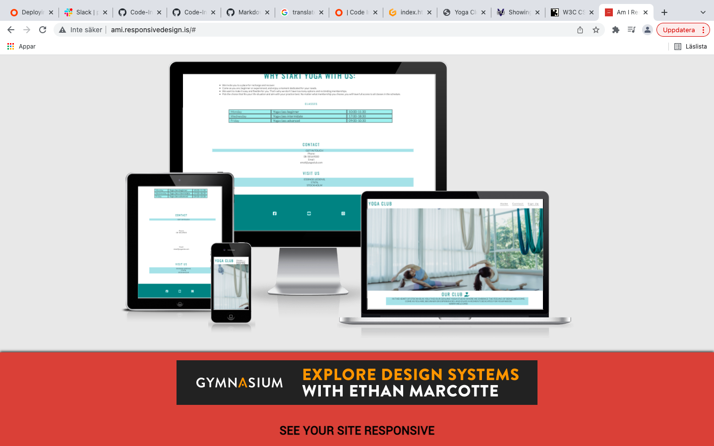
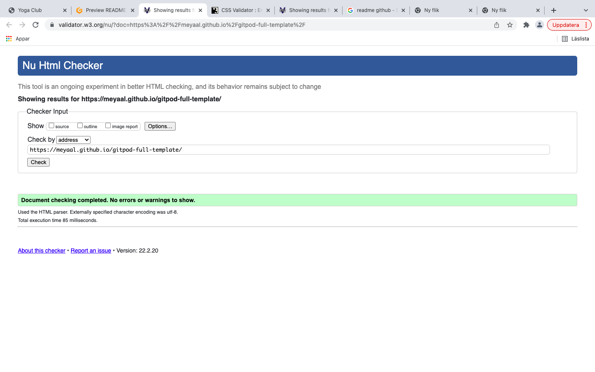
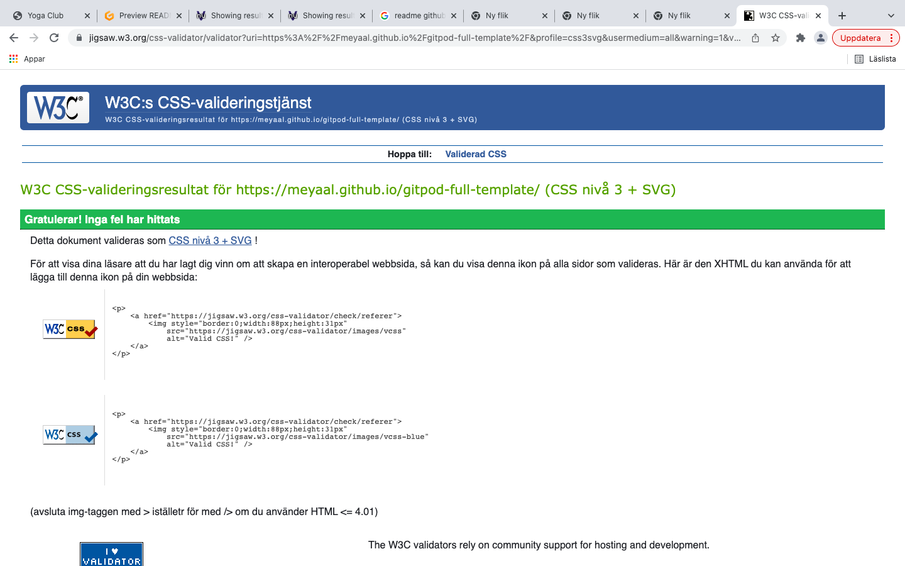
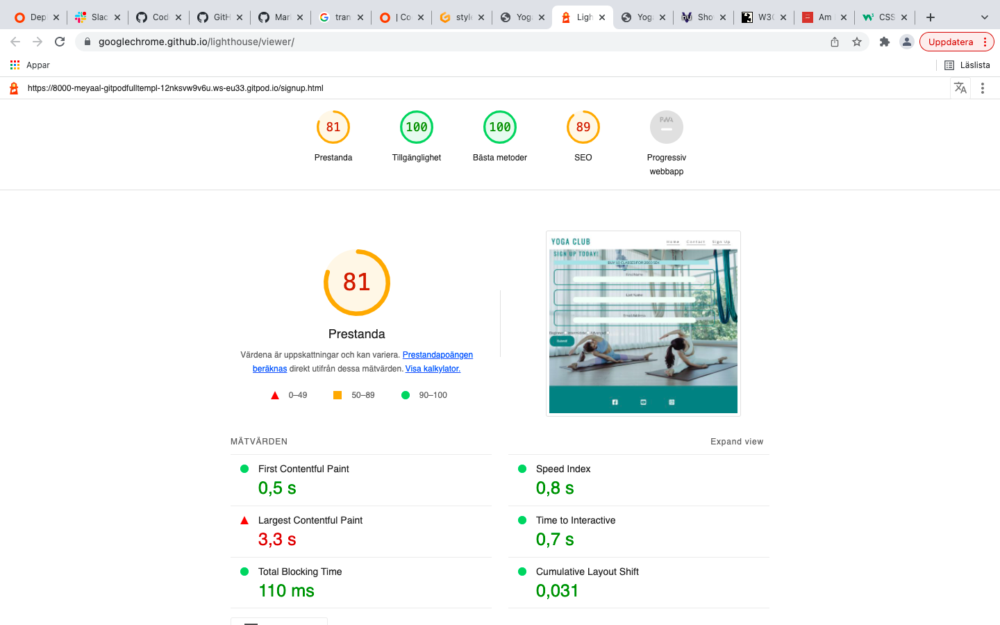

# My first portfolio

## Yoga Club

Is a webbsite about a yoga studio in Stockholm that offers diffirent levels of Yoga classes. The club offers an joyful enviroment to recover. 

Users of the website will be able to find all information about classes times, contact information and a sign up form and prices. 

Inline-style: 

# Navigation 
The user will se name of the top of page on the left side. On the right side are the menu with home, contact and sign up.

The navigation shows a description about the club underneth the hero image. 

The other navigation links are about home page that contains information about what the club offers as well as a timetable for different classes, further down the page, contact information comes to the club.

The navigation clearly tells the user to the name of the club and webbsite and makes the different sections of information easy to find. 

# YOGA CLUB

The header is written with the color Teal. The section gives the user information about what the page is and who the club is for. The section gives the user the opportunity to read more about the club environment and why it is a good idea to start right there at the club. There is a schedule with different classes and timetable for these.

# CONTACT

The contact section gives datails about the important information to get in touch with the club. There is a phone number and a email address. There is a address to visit the club. 

# SING UP

When the users click the sing up they will go to another page, page 2. They will find information about the price and a form to complete with first name, last name and email adress. Then they are able to clik on submit buttom to send the form. 

# Design

## Colour Scheme
The three main colours used are Teal, MintCream and white.

## Typography

The Lato and oswald fonts is the main font used throughout the whole website with Sans Serif as the fallback font in case for any reason the font isn't being imported into the site correctly. 

#### I used fontawsome from Javascript to have some fonts, I writed a link in the html files at the bottom of the fiels. 

# Imagery
 Imagery is important. The large, background hero image is designed to be striking and catch the user's attention. It conveys a fresh and pleasant environment.

# Langueges uses
#### HTML5
#### CSS3

# Testing 

I tested that this page is working on different browsers like Chrome, Firefox and Safari. 

I confirmed that this project is responsive on some different screens sizes. It looks good and functions on standard screen sizes using devtools devise toolbar. 

I have confirmed that the form works requires entries in every field will only accept an email in the field. My submit button didn't work at the moment. This is something that I'll want to fix.

The W3C Markup Validator and W3C CSS Validator Services were used to validate every page of the project to ensure there were no syntax errors in the project. I'll leave a screenshot in case the link doesn't work.

W3C Markup Validator

[W3C HTML validator link](https://validator.w3.org/nu/?doc=https%3A%2F%2Fmeyaal.github.io%2Fgitpod-full-template%2F)

Inline-style: 

W3C CSS Validator

[W3C css validator link](https://jigsaw.w3.org/css-validator/validator?uri=https%3A%2F%2F8000-meyaal-gitpodfulltempl-12nksvw9v6u.ws-eu33.gitpod.io%2F&profile=css3svg&usermedium=all&warning=1&vextwarning=&lang=sv) 

Inline-style: 

# Assesbility
I confirmed that the colors and fonts chosen are easy to read and accessible by running it throught lighthouse. 

Inline-style: 

## Unfixed Bugs

My Submit buttom is not clickble despite several tries to make it work. I did google serch and tried to change the code but didn't mange it. 

The code might not really be full responsive on a smaller phones screens. The whole image is not seen but only the top part.

# DEPLOYMENT 
The site was deployed to GitHub pages, the steps are as follows:

In the GitHub respository, navigate to the Settings tab. From the source section drop-down menu, select the Master Branch. Once the master branch has been selected the page provides the link to the completed website. 

You'll find the link here

[My site link](https://meyaal.github.io/gitpod-full-template/
) 

## Content 
The code to make the social media links was taken from the Love Running project.

The code to make the table was taken from the Coffee Coders project.

The code to make section for hero-image and hero-outer was taken from the Love Running project.

The code to make the menu was taken from the Love Running project. 

# Further development

I would like to develop the page with more information such as images and more detailed information about the different classes and prices. I'll add more of awsome fonts and presentation trainers working there. There is much that can be developed in the page. 