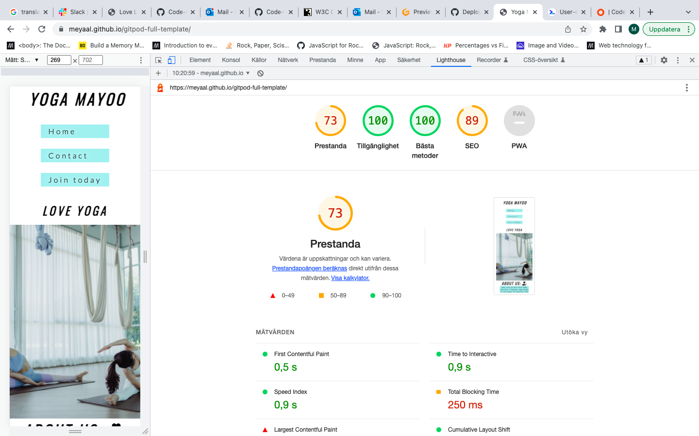

# My first portfolio

## Yoga Mayoo

Is a webbsite about a small yoga studio in Stockholm that offers yoga classes. The site is basic and clear.

Inline-style: 

*** 

## Users Stories

### First Time Visitor Goals
1. As a First Time Visitor, I want to easily understand the main purpose of the site and learn more about the club. 

2. As a First Time Visitor of the website, I want to easily navigate throughout the site to find content.

3. As a First Time Visitor, I want to look for testimonials to understand what their users think of them and see if they are trusted. I also want to locate their social media links to see their followings on socialmedia to determine how trusted and known they are. 

### Returning Visitors Goals
 1. In order to guide the user to what they want the navigation, footer and content are laid out in a clear way.

 2. As a Returning Visitor, I want to find the best way to get in contact with the club with any questions I may have.

 3. As a returning Visitor, I want to fint community links. 

### Frequent User Goals

1. As a Frequent User, I want to check to see if there are any newly added challenges or hackathons.

2. As a Frequent User, I want to check to see if there are any new blog posts.

3. As a Frequent User, I want to sign up to the Newsletter so that I am emailed any major updates and/or changes to the website or club.

# Design

### Color Scheme
 * The three main colours used are Teal(#008080), MintCream(#F5FFFA), white(#fff) and black(#000)

### Typography

* The Lato and oswald fonts is the main font used throughout the whole website with Sans Serif as the fallback font in case for any reason the font isn't being imported into the site correctly. These fonts were obtained using Google Fonts and differnt sizes were used. 

### Imagery
* Imagery is important. The large, background hero image is designed to be striking and catch the user's attention. It conveys a fresh and pleasant environment.
The second image conveys a calm and healthy yoga in nature. Nature is an important part of yoga. 

# Features

## Existing Features
### Navigation Bar

* The navigation menu is featured at the top of the pages and contains the links to main content.

inline-style:

* Featured on all three pages, the full responsive navigation bar includes links to the Home page, Contact page and Join Us page and is identical in each page to allow for easy navigation.
* The navbar will allow the user to easily navigate from page to page across all devices without having to revert back to the previous page via the ‘back’ button.

* Each page, except the Home Page, has a clear heading when landing on the page and short paragraph introducing the content. The language, colour and design used is intended to be friendly and easy to understand.

* Each page has a clear heading when landing on the page. The language, colour and design used is intended to be friendly and easy to understand.

## Yoga Mayoo

### The landing page image

* There is a large hero image chosen for its' style, colour scheme and tone to match the website itself and it's immediately visible.

### About Us
* The user will find short information about the club below the hero image.

inline-style

### Chooce a class

inline-style

* The section contains descriptive information of each class depending on the needs of the user. 
* There are three different classes with text on what to expect from each class

### Classes 
* The section contains a timetable for which times the yoga classes take place.

### Prices
* The section has gott a list with information about membership prices. 

### The Footer

inline-style

* The Footer contains the social media links.

* For better UX design, each of the social media links open in a new tab.

* The Facebook, Instagram and Youtube links are purely for the educational purposes of the website and only navigate to the home page of each of the sites.

inline-style

### Contact page

inline-style

* This page has information about the adress, a phone number and emailadress for the club. 

* It's clean and easy to find the contact information. 

### Join Us 

inline-style

* This page contains form that user can fill in name, surname and email address.

* User can choose one of the three classes presented below the form and register their interest in joining the club.

* The form uses a Post function. There is no actual information submitted when the user completes the form.Code institute home address was used to make the form interactive. 

### Features Left to Implement

* Homepage could have some more images which relates to the text describing the classes.

* Gaps exist in between navbar on small screens.The mobile navigation menu could be changed into a burger menu.

* There is gaps in contact page especially on small screens.

* Create mailto function for the email adress to open the devices preferred email software.

***

## Technologies Used

### Languages Used

* #### HTML5 -Delivers the structure and content for the website.
* #### CSS3 -Provides the styling for the website.

## Frameworks, Libraries & Programs Used

1. Google Fonts: 

* Google fonts were used to import the 'Titillium Web' font into the style.css file which is used on all pages throughout the project.

2. Font Awesome:

* Font Awesome was used on all pages for social media links throughout the website to add icons for aesthetic and UX purposes.

3. Git: 

* Git was used for version control by utilizing the Gitpod terminal to commit to Git and Push to GitHub.

4. Github: 
* GitHub is used to store the projects code after being pushed from Git.

*** 

## Testing 

### The site has been tested and it's working on different browsers like Chrome, Firefox and Safari.

### Responsivness

The site is responsive on different screens sizes. It looks good and functions on standard screen sizes using devtools devise toolbar. 

### The Form

The form on Join us page is confirmed that it works requires entries in every field will only accept an email in the field. The user can choose on of the buttons for the different classe. The Submit button is working.

### Code Validation
#### The W3C Markup Validator and W3C CSS Validator Services were used to validate every page of the project to ensure there were no syntax errors in the project. 

W3C HTML Validator.

### HTML
 No errors were returned when passing through the official

inline-style:

inline-style:

inline-style:

***

 W3C CSS Validator

 ### CSS

 No errors were found when passing through the official

inline-style:

***

## Unfixed Bugs

* The top af the image on Join Us page is not visible, the top of the image is visible on smaller screens. 
* A white gap can be seen to the right of the footer and navigation bar as a result.

***

## Deployment

* The site was deployed to GitHub pages. The steps to deploy are as follows:
* In the GitHub repository, navigate to the Settings tab
* From the source section drop-down menu, select the Master Branch
* Once the master branch has been selected, the page will be automatically refreshed with a detailed ribbon display to indicate the successful deployment.
*** 

## Cresdits

### Code
* The code to make the social media links was taken from the Love Running project.

* The code to make the table was taken from the Coffee Coders project.

* The code to make section for hero-image and hero-outer was taken from the Love Running project.

* The code to make the menu was taken from the Love Running project. 

* W3Schools
* The code to make the fieldset in form is from Mmdn Resources for Developers,
by Developers.

***

## Lighthouse Testing

inline-style:
:

The perfomace value is 73% 

## Media

## Acknowledgements

